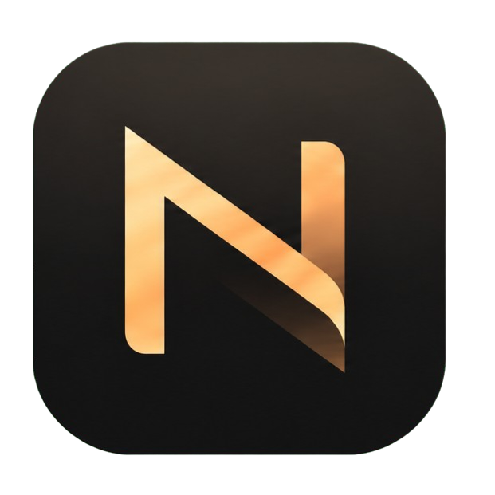

<section class="noqlen-hero">

<h1>Local music-library workflows, controlled by you</h1>

<strong>Noqlen Forge Core</strong> is the first public component of the Noqlen ecosystem: a CLI-first metadata and library-management core for local music collections.

  <a href="forge/first-safe-workflow/">Get started</a>
  <a href="forge/installation/">Install Forge</a>
  <a href="forge/safety/">Safety model</a>
  <a href="https://github.com/jssantogit/noqlen-forge-core">GitHub repository</a>

</section>

## Current Focus

Noqlen Forge Core helps scan, audit, enrich, organize, review, and report on a local music library. It is designed for careful operators who want visibility before writes, not a black-box cleanup button.

<h3>Metadata With Review</h3>

Audit and enrich album metadata while keeping low-confidence and conflicting results visible for review.

<h3>Library Awareness</h3>

Use local database and scan workflows to understand collection state before rewriting tags or moving files.

<h3>Server-Friendly Workflows</h3>

Support Navidrome-oriented ratings, playlists, reports, and review flows without claiming real-time server integration.

<h3>Dry-Run First</h3>

Prefer plans, reports, and explicit apply steps for write-capable operations against real libraries.

## Ecosystem Context

Noqlen is the master ecosystem name. Forge is the mature public product area documented here today. Flux, Anchor, Core, and Aria are future or planned ecosystem directions and should be read as context, not implemented products.

## Safety Posture

Start with help, smoke checks, configuration review, database status, and dry-run workflows. Do not begin with destructive or apply operations on a real library. Do not publish secrets, full lyrics, raw fingerprints, private library dumps, or real local paths in issues, logs, examples, or commits.
